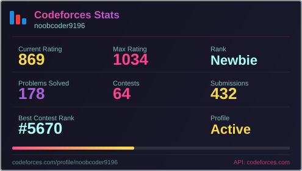
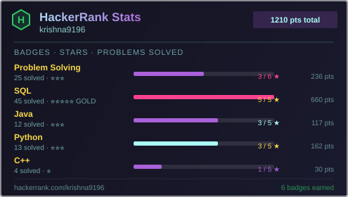

  

  

<h1 align="center">
  
</h1>

  

  

### 👾 [ DATA_LOG: SUMMARY ]
> **STATUS:** 🟢 ONLINE
> **CURRENT_DIRECTIVE:** Programmer Analyst @ IDrive Software India

- ⚡ **CORE_PROFILE:** Software engineer with 2+ years of experience building production applications on Apple platforms.
- 🛠 **EXPERTISE:** Swift, Objective-C, Xcode, CI/CD pipelines, third-party SDK integration, and performance debugging.
- 🧠 **FOUNDATION:** Strong background in OOP, SOLID principles, Data Structures, Algorithms, and System Design.
- 🚀 **GOAL:** Eager to apply my expertise to iOS mobile and Full Stack development.
- 📄 **EXTERNAL_LINK:** <a href="https://drive.google.com/file/d/152jcg5mzNXb99MxrAs9MncV6yyZu5dub/view?usp=sharing" target="_blank" rel="noopener noreferrer">ACCESS_RESUME</a> 

 

### 💽 [ SYSTEM_HISTORY: EXPERIENCE ]

**[ <a href="https://www.idrive.com/" target="_blank" rel="noopener noreferrer">IDRIVE SOFTWARE INDIA</a> ]** // *Programmer Analyst (Jul 2023 – Present)*
- 🔹 Built and shipped features in a massive Swift/Objective-C/C codebase directly on Apple platforms.
- 🔹 Integrated the Wimlib open-source engine, boosting performance metrics: **2.5x faster backups** & **3x faster restores**.
- 🔹 Engineered a **GitLab CI/CD** pipeline for automated macOS build generation.
- 🔹 Developed a robust **co-brand framework** that adapts system logic and UI for partner clients.

**[ C-DAC CINE ]** // *Full Stack Web Dev Intern (Jun 2022 – Jul 2022)* — 🔹 Built full-stack solution with JWT-secured server architecture, custom data collection forms, and interactive dashboards for data visualization.

 

### 🎓 [ MEMORY_BANKS: EDUCATION ]
- 🎓 **B.Tech in Computer Science & Engineering**
  - *National Institute of Technology Silchar (Grad: Jun 2023 | CGPA: 8.39)*

  

### ⚙️ [ LOADED_MODULES: TECH_STACK ]

> **// CORE_LANGUAGES**

  
  
  
  
  
  

> **// FULL_STACK_&_DATABASES**

  
  
  
  
  
  
  
  

> **// DEVOPS_&_TOOLS**

  
  
  
  
  

  

### 📂 [ DEPLOYED_ASSETS: PROJECTS ]
- 🟢 **[ <a href="https://mernstackblogapp.netlify.app/" target="_blank" rel="noopener noreferrer">Blog App (MERN Stack)</a> ]** 
  - *Tech: React.js, Node.js, Express, MongoDB*
  - Built a full-stack blog application with complete CRUD operations.
  - Implemented secure user authentication and protected API routes using JWT.

 

### 📖 [ ARCHIVES: PUBLICATIONS ]
- 🟢 **[ <a href="https://digital-library.theiet.org/doi/10.1049/pbhe059e_ch5" target="_blank" rel="noopener noreferrer">Deep Learning in Medical Image Processing and Analysis (IET)</a> ]** 
  - *Comparative Analysis of Lumpy Skin Disease Detection Using Deep Learning Models*
  - Co-authored published book chapter analyzing deep learning models for medical image classification.

  

### 📈 [ TELEMETRY: STATS ]

  

  
  

  
  

  

### 📡 [ NETWORK: UPLINK ]

  
  
  
   
  
  
  

